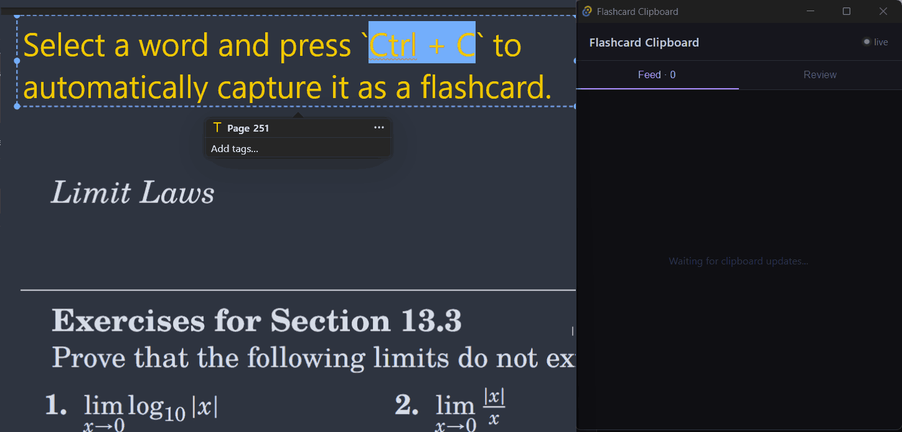

# Flashcard clipboard


## Overview

**Simply press `Ctrl+C` (or `Cmd+C` on macOS) while the app is running to capture any copied text as a flashcard!**




`flashcard_clipboard` turns copied text into flashcards with a local Python backend and a Tauri desktop UI. The backend watches the clipboard, translates or normalizes captured text, stores flashcards in SQLite, and broadcasts new cards over WebSocket so the UI can update live.

## Features

- **Clipboard capture pipeline** that turns copied text into stored flashcards
- **Live desktop UI** built with Tauri + React
- **Feed view** for newly captured cards with live connection status
- **Review mode** for revealing translations and tracking learned cards
- **SQLite persistence** for local storage
- **WebSocket updates** so the UI stays in sync without polling

## Running The App

Start the Python backend first, then launch the Tauri UI.

```bash
python main.py
```

In a second terminal:

```bash
cd tauri-ui
pnpm install
pnpm tauri dev
```

The UI connects to:

- `http://127.0.0.1:51847/flashcards` for the initial card list
- `ws://127.0.0.1:51847/ws` for live card updates

## Project Structure

```text
flashcard_clipboard/

├─ api.py
├─ docs/
│  └─ architecture.md

├─ domain/
│  └─ models.py

├─ infrastructure/
│  ├─ clipboard.py
│  ├─ hotkeys.py
│  ├─ test_hotkeys.py
│  ├─ persistence/
│  │  ├─ db.py
│  │  └─ repository.py
│  └─ translate/
│     ├─ clients.py
│     └─ service.py

├─ pipeline/
│  ├─ app.py
│  ├─ queues.py
│  ├─ stages.py
│  └─ test_stages.py

├─ services/
│  └─ dedup.py

├─ utils/
│  ├─ lru.py
│  └─ text_normalizer.py

├─ tauri-ui/
│  ├─ package.json
│  ├─ src/
│  │  ├─ App.tsx
│  │  └─ App.css
│  └─ src-tauri/
│     └─ src/
│        └─ main.rs

├─ .gitignore

├─ config.py

└─ main.py
```

## Desktop UI

The Tauri app has two tabs:

- **Feed** shows newly captured flashcards in reverse chronological order and highlights the latest card
- **Review** shows one card at a time, lets you tap to reveal the translation, and tracks cards you already know

The header also shows whether the UI is connected to the backend, and the feed reconnects automatically if the websocket drops.
